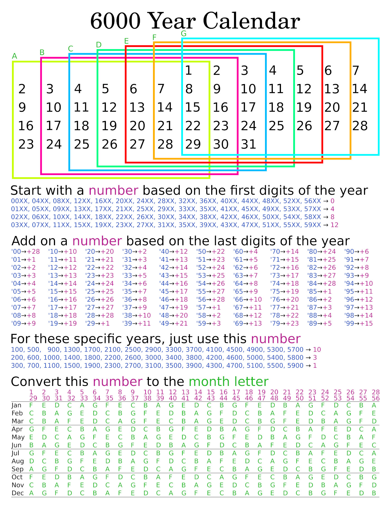

# tkoop/6000YearCalendar
This is a 6000 year calendar on one page.

These were the design goals:
- Fit on one page of paper
- Be simple and intuitive to use, with as little math as possible (so I won't be explaining here how to use it)
- Try to look good

## License

This project is licensed under the Creative Commons Attribution Share Alike 4.0.

